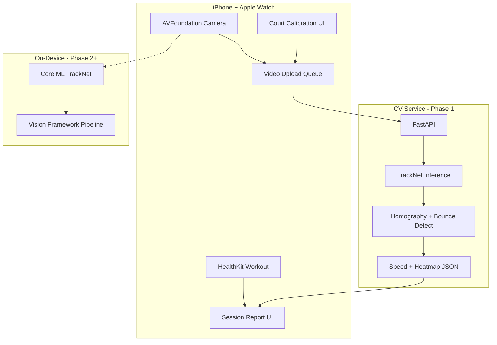

# CourtLog Architecture

## Product goal

Help recreational tennis players understand **where balls land**, **approximate speed**, and **how hard they trained** — using one iPhone on a tripod at the side of the court, plus Apple Watch.

SwingVision-level accuracy is a **long-term target**, not v0.1. We ship value early with hybrid manual + cloud CV.

---

## System diagram



---

## Why hybrid cloud-first CV

| Approach | Pros | Cons | Phase |
|----------|------|------|-------|
| **Cloud post-process** | Best accuracy, any phone thermal budget, reuse Python OSS | Needs network, latency minutes | **v0.1** |
| **On-device Core ML** | Offline, real-time potential | Model size, battery, conversion effort | **v0.3** |
| **Real-time on-device** | SwingVision-like UX | Hardest; needs GridTrackNet + ANE tuning | **v1.0** |

**Decision:** v0.1 uploads video after session; user sees report in 2–5 minutes. Parallel track converts TrackNet to Core ML for v0.3.

---

## iOS app modules

| Module | Responsibility |
|--------|----------------|
| `App` | SwiftUI entry, navigation, dependency injection |
| `Capture` | Camera preview, recording (1080p30), tripod hints |
| `Calibration` | User taps 4 court corners → homography matrix stored per session |
| `Health` | `HKWorkoutSession` + watch companion, HR samples |
| `Sessions` | Local persistence (SwiftData), upload state machine |
| `Analysis` | Poll cloud job / decode JSON → overlays |
| `Report` | Heatmap, speed chart, share image |
| `Networking` | Multipart upload, job status API |

### Key frameworks

- **SwiftUI** — UI
- **AVFoundation** — capture & export H.264
- **HealthKit** — Apple Watch workout + heart rate
- **Vision + Core ML** — Phase 2 ball detection
- **SwiftData** — local session store

---

## CV pipeline (cloud service)

Based on open-source patterns from ArtLabss/tennis-tracking and servetracker:

```
Video MP4
  → extract frames @ 30fps
  → optional: court line keypoints (YOLO / ResNet) OR use user calibration homography
  → TrackNet: 3-frame windows → ball (x,y) per frame
  → temporal filter + gap interpolation
  → bounce detection (velocity sign change + y local max)
  → map pixel → court meters via homography
  → speed = Δposition / Δt
  → aggregate: heatmap grid, max/avg speed, rally count
  → JSON + annotated preview MP4
```

### Open-source building blocks

1. **TrackNet** ([yastrebksv/TrackNet](https://github.com/yastrebksv/TrackNet)) — pretrained weights available; input 640×360, 3 consecutive frames.
2. **Homography** ([servetracker](https://github.com/bradymcatee/servetracker)) — 4+ court points → map to standard court coordinates.
3. **Bounce detection** — heuristic from ArtLabss (vertical velocity flip near court plane).
4. **Court keypoints** (optional v0.2) — YOLOv8 court model from tennis-analysis repos for auto-calibration.

### Core ML conversion path (Phase 2)

```python
# cv-service/scripts/export_coreml.py
import coremltools as ct
# Load PyTorch TrackNet → trace → ct.convert → TrackNet.mlpackage
# Target: Neural Engine, float16, ~640×360 input
```

iOS runs `VNCoreMLRequest` on downscaled frames; cloud remains fallback for full accuracy.

---

## Data model

### Session (local + server)

```json
{
  "id": "uuid",
  "createdAt": "ISO8601",
  "durationSec": 3600,
  "calibration": {
    "imagePoints": [[x,y], ...],
    "courtPointsMeters": [[0,0], [10.97,0], ...]
  },
  "health": {
    "avgHeartRate": 142,
    "activeCalories": 520,
    "workoutType": "tennis"
  },
  "analysis": {
    "status": "pending|running|done|failed",
    "ballPositions": [{"t": 1.2, "x": 3.4, "y": 8.1}],
    "bounces": [{"t": 1.25, "in": true, "speedKmh": 72}],
    "heatmap": {"grid": 10, "counts": [[...]]},
    "maxSpeedKmh": 98,
    "avgSpeedKmh": 61
  }
}
```

---

## Camera & recording constraints

Document for users in-app:

| Rule | Reason |
|------|--------|
| Fixed tripod, **side view** (not behind baseline) | TrackNet trained on broadcast angle |
| Full court visible | Homography needs 4 corners |
| 1080p, 30fps, good daylight | Ball is tiny; motion blur kills detection |
| Min 2m height recommended | Reduce player occlusion |

v0.1 shows overlay guide: "align court lines with template".

---

## Apple Watch integration

1. iPhone starts `HKWorkoutSession` (activity: tennis / traditional strength training fallback).
2. Watch shows elapsed time + HR (companion Watch app optional in v0.2).
3. On session end, merge samples into report.

**Permissions:** `HealthKit` read/write workout, heart rate.

---

## Security & privacy

- Videos uploaded over HTTPS; delete server copy after 7 days (configurable)
- On-device option (Phase 2) for users who opt out of cloud
- No account required for MVP — device anonymous ID + optional Sign in with Apple later

---

## Tech stack summary

| Layer | Choice |
|-------|--------|
| iOS | Swift 5.9+, SwiftUI, iOS 17+ |
| Watch | watchOS 10+, HealthKit mirror |
| Backend | Python 3.11, FastAPI, PyTorch (TrackNet), Redis job queue |
| Storage | S3-compatible object store + Postgres metadata |
| CI | GitHub Actions (iOS build on macOS runner) |

---

## Risks & mitigations

| Risk | Mitigation |
|------|------------|
| Ball not detected (practice feeds, night) | Manual tap-to-mark fallback in report editor |
| Homography drift | Re-calibrate each session; show quality score |
| Cloud cost | Limit free tier to 3 sessions/month; compress HEVC |
| App Store rejection (HealthKit) | Clear privacy policy, minimal health claims |
| TrackNet ≠ practice camera angle | Fine-tune on user-submitted clips (opt-in) v0.4 |
